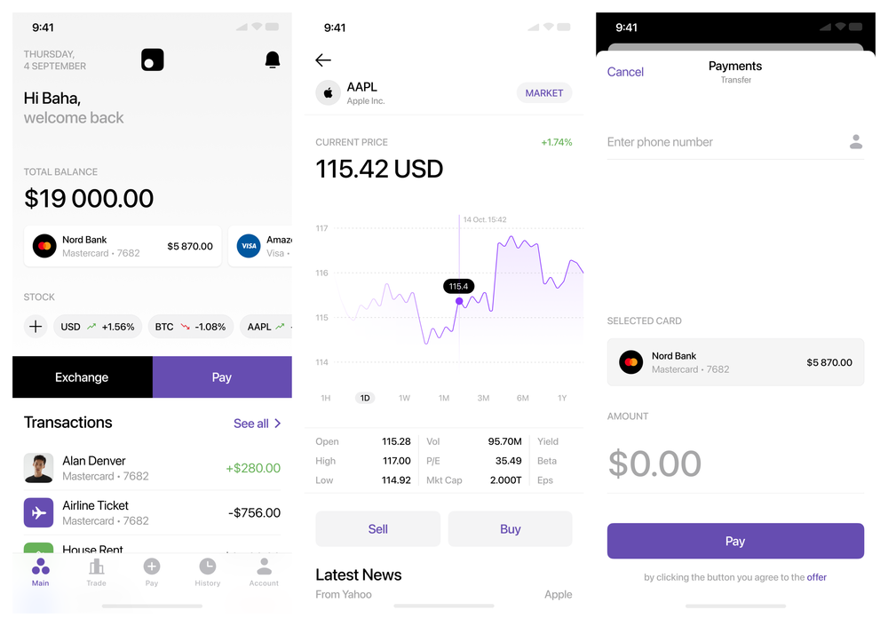

# CryptoMarket

- Application for keeping track of funds on your credit cards.
- Used Alpha Vantage API to get data about company stocks in CSV format and parse it.
- Used coinpaprika API to get data about cryptocurrencies.
- Used Room database to save data about credit cards and transaction history.
- Used: Kotlin, MVVM + Clean Architecture, Koin, Retrofit, Jetpack Navigation, Room.
